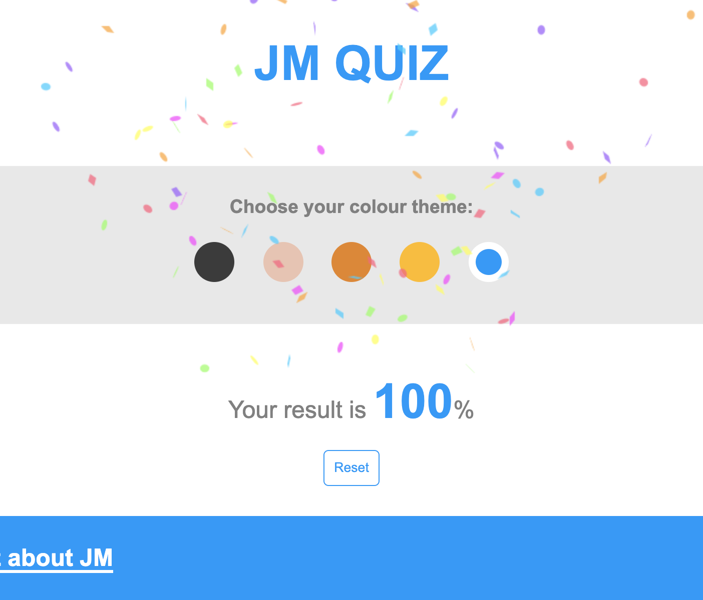

# pj__web-app__1-quiz-app
## Info
- **Title**: Quiz app
- **Author**: JM Woo
- **Link**: https://jayxwoo.github.io/pj__web-app__1-quiz-app/
- **Log**: https://www.notion.so/1-Quiz-app-a41af37034d94553914569d57bfbc863

## Features
- Questions with multiple choice answers
- Submit button
- When submit button is clicked
  - calculate score in percentage
  - display score with number increment animation
- scroll to top button
- confetti animation when score is 100%

## Skills
- HTML
- CSS
- JavaScript
  - DOM manipulation
  - CSS style manipulation
  - object
  - class
  - event listener
  - forEach
  - scrollIntoView
  - setInterval & clearInterval
  - 3rd party library; canvas-confetti

## Screenshots
